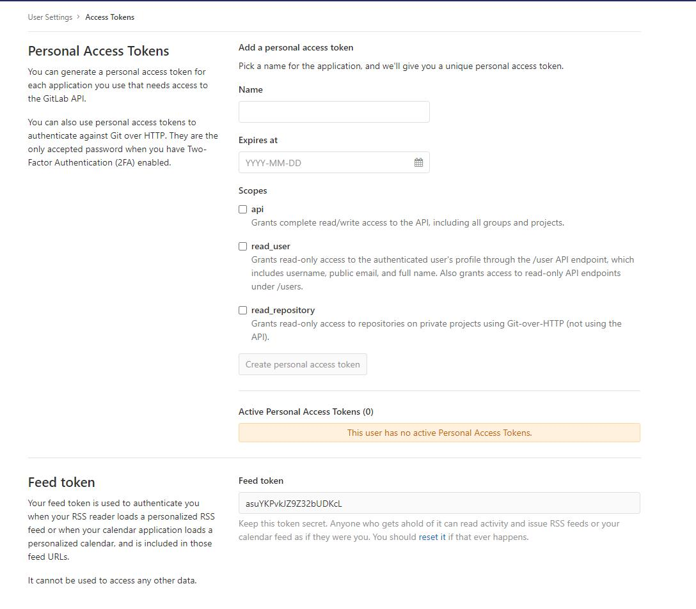

# gitLab Code Review

## GitLab Code Review 机制

- GitLab可以在分支合并的时候支持两种方式：

1. 在本地将源分支(Source branch)代码合并到目标分支（Target branch）然后Push到目标分支（Target branch）；
2. 将源分支(Source branch)Push到远端，然后在GitLab指定目标分支（Target branch）发起Merge Request，对目标分支（Target branch）拥有Push权限的用户执行Merge操作，完成合并。

> 也就是说，使用GitLab进行Code Review就是在分支合并环节发起Merge Request，然后Code Review完成后将代码合并到目标分支。

## Gitlab Code Review 配置

### 1. Code Review 工作流

- 通用git工作流说明

1. 需求确认后，开发人员从master分支创建自己的feature分支进行开发；
2. master分支发生变更，需要从master分支合并到feature分支；
3. feature分支合并到dev分支，发布开发环境；
4. feature分支合并到release分支之后，发布到测试环境进行测试；
5. release分支在测试环境测试通过之后，feature合并到uat分支并发布到预发布环境进行测试；
6. uat分支在预发布环境验证通过后，合并到master分支并发布到生产环境进行验证。

- 分支名称约定：

分支类型 | 名称格式 | 说明
---|---|---
Master | master | 有且只有一个
Uat | uat-* | * 可以是班车发布日期也可以是需求名称缩写，也可以根据需要只用一个uat分支
Release | release-* | * 可以是班车发布日期也可以是需求名称缩写，也可以根据需要只用一个Release分支
Dev | dev-* | * 通常是班车发布日期或者需求名称缩写，可以根据需要只用一个develop分支
Feature | feature-${username}-* | 开个人员个人分支，*通常是班车发布日期或者需求名称缩写
hotfix | hotfix-${username}-* | 开个人员个人紧急修复分支，*通常是班车发布日期或者需求名称缩写

- Code Review 环节选定

### 2. GitLab Repository 配置

- GitLab创建仓库&创建分支，这个操作比较简单，就不详细说了。
- Protected Branches 配置

> 为了保证必须以Merge的方式变更develop分支、release分支、uat分支、以及master分支，我们需要对Push以及Merge权限进行限制
> 菜单：Settings->Repository Settings然后展开Protected Branches选项

## GitLab Code Riview 示例

- 创建Merge Request

> 操作项/填写项说明：

操作项 | 说明
---|---
Title | 标题，没有特殊要求保存默认即可
Description | 描述，需要将变更的需求描述清楚，最好附近code review要点【可以是confluence文档】
Assignee | 分配到的人，被分配到的人将会受到邮件通知，跟merger权限没有必然关系，仍然是项目的Maintainers(Masters)角色拥有merge权限
Milestone | 里程碑，可选项
Label | 标签，可选项
Approvers user | 批准人/审批人，必须为项目所在组成员，如果选择了批准人，那此次合并必须经由批准人批准
Approvers group | 批准人组，方便同时选择多个批准人
Approvals requeired | 最少批准个数，如果选了个3个批准人，Approvals required设置为1， 那么只需要1个批准人批准即可
Source branch | 源分支
Target branch | 目标分支

- Merge Request 操作

## IDE Merge Request 插件使用

> 可用插件也可用gitLab界面操作。

> 前面介绍了通过GitLab网页创建Merge Request并发起Code Review，但作为开发人员，还是结合IDE来使用会更顺手，GitLab提供了相关的api，只要我们创建响应的token，就可以供IDE插件来访问GitLab，以便使用IDE代替在网页上操作。

- GitLab Access Token

  - 菜单：User Setting -> Access Tokens 进入Access Token添加页面

操作项 | 说明
---|---
Name | 名称，按自己喜欢来即可
Expires at | 过期时间，最远可以选择到10年后，根据自己需求填写即可
Scopes | 范围，这里选择api就够用了

> 创建完成后，需要暂时保存token。因为一旦刷新或者重开页面，token就不可见了。

- Visual Studio Code 使用GitLab MR 插件

> 插件：`https://marketplace.visualstudio.com/items?itemName=jasonn-porch.gitlab-mr`

- 安装插件

- 设置插件

